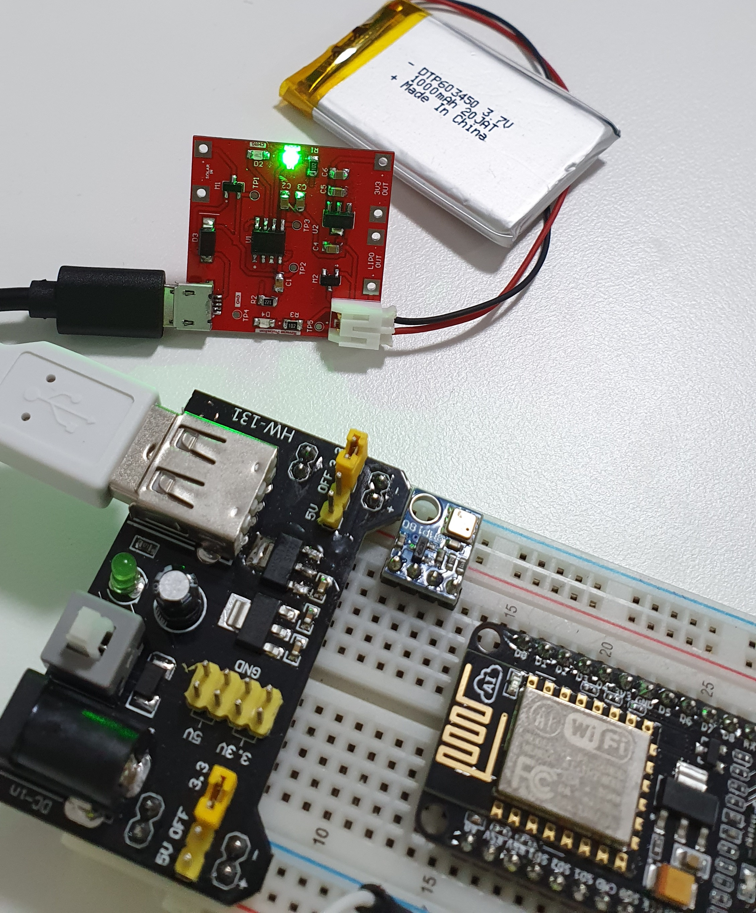

# Lipo_Solar_manager_V2 (Completed)
## Goal:
A board that supports lipo charging with USB or solar, produces 3.3V or 4.2V power out.
To rectify issues from version one.

## Requirments:
1. Support USB or Solar in for charging.
2. 2 options output (3.3V/Lipo)
3. Low power as possible (To support low power project)
## Implementation:
### Schematic:
 
### PCB:
 
## Product and testing:
Here is the actual PCB. 
Charging:
 
Charing Completed:
 
After ultilizing test points and manual probing with multimeter, results are correct.
1. Lipo output = 4.2V (checked,OK)
2. 3.3V regulted output (checked,OK)
3. Charing circuit working, with usb/solar in (checked,OK)
4. 5V in (checked,OK)
3. Stable output (checked,OK)
## Conclusion
This project is a success everything works as intended. 
This design is able to charge a lipo battery using 5V USB in or solar charging, and produce a stable 3.3V output. 
Now it can be used for powering up low power projects. (Tested with ESP12 chips, works well).

